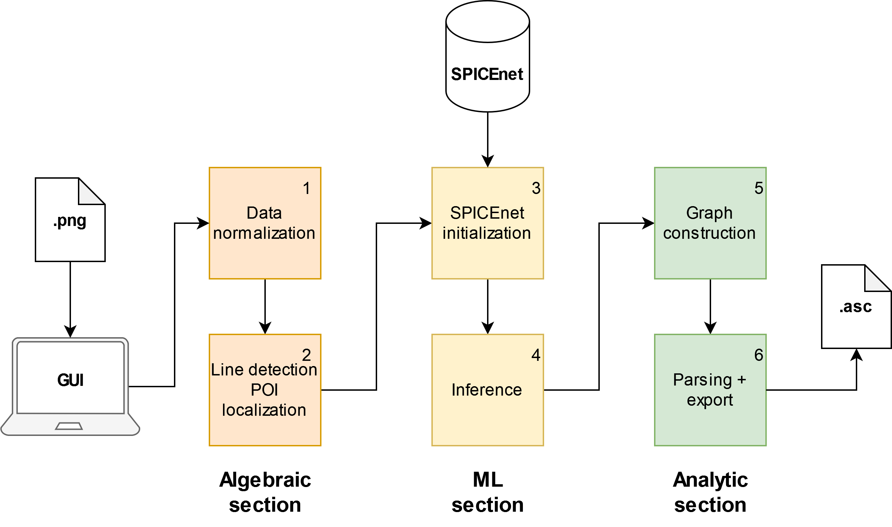

# PNG2SPICE

### |[ About](#about) | [Setup](#setup) | [Usage](#usage) | [Structure](#structure) | [Issues](#issues) | [Paper](#paper) |

## About
Need a reference design in LTSPICE but only have screenshots available? Manually copying is **boring**, so just use **PNG2SPICE**!

**PNG2SPICE** uses image processing and the convolutional neural network [SPICEnet](https://github.com/jake-is-ESD-protected/SPICEnet) to detect, classify and localize electrical components from an image. It is then parsed into a `.asc` file which can be opened by LTSPICE. Check out [SPICEnet](https://github.com/jake-is-ESD-protected/SPICEnet) to see which components it supports.

**PNG2SPICE** is a combination of various algebraic, statistical and analytical procedures which aim to convert an image of a schematic into its representation in LTSPICE. 

## Setup
You can try **PNG2SPICE** for yourself, if you have experience with Git, Python and pip. Create a virtual environment and install the requirements.
**Be sure that you have `pytesseract` and `tkinter` installed, as those are not managed by pip. Depending on your system, you have to install them manually.** After that, you can come back to Git and pip:
```
git clone https://github.com/jake-is-ESD-protected/png2spice
python3 -m venv .env
source ./.env/bin/activate      # for Linux
./.env/Scripts/activate         # for Windows
pip install -r requirements.txt
pip install -e .
```
On Linux, you might have to install `sudo apt-get install xclip` for the GUI to work.

## Usage
Head to [`gui.py`](/png2spice/gui.py) in the [`png2spice`](/png2spice/) folder and launch the python file. A `tkinter` window will pop up after some time. If you're starting the app for the first time, it may take longer, as starting the app also loads `tensorflow` and `keras`. You can then copy a schematic image to clipboard and paste it into the left panel of the app with `Ctrl+v`. Select a folder for the working data and output (make sure that the folder is empty!) and hit `Analyze`. A progress window will pop up. As soon as that is done, the output folder will then contain your `output.asc` file.


Right now we support the following parts/symbols/components:
- Resistor
- Capacitor (non-polarized)
- Inductor (simple)
- (Diode) (without rotational data)
- GND


## Structure
The structure of **PNG2SPICE** is best described with the organigram below:



The stages you see are also seen in the progress bar. The supplied image first undergoes a normalization and the **Hough** algorithm to detect lines, which then also yield the positions of possible components. After that, [SPICEnet](https://github.com/jake-is-ESD-protected/SPICEnet) is activated and inference is performed on the so called "POIs" (points of interest). After that, the obtained data is combined in a virtual graph representation and linked together. The final stage converts the abstract representation into LTSPICE syntax. We also encourage you to view the code, as it is documented densely.

## Issues
As we learned while doing this project, classification of schematics is a very hard thing to do. Symbols are not globally standardized, resolutions, spacing and verbosity vary immensely between schematics and copied schematics have to be manually adjusted anyways. For this reason, **PNG2SPICE** is just an adversary tool designed to help with placing components. To date, the following issues exist:

- Rotation of diodes is missing
- system requires fine-tuning (which just moves the problem from the electrical engineer to us)
- Analytical approach causes many uncaught problems
- Quality of output has massive variance

While some of these issues lay with us and our short development time and understaffing, other issues might not be tackled any time soon even with more development. Right now, the task of accurately analyzing a schematic of real-world-relevance seems to be a task too complex and special for AI.

## Paper
See the accompanying paper [here]().

